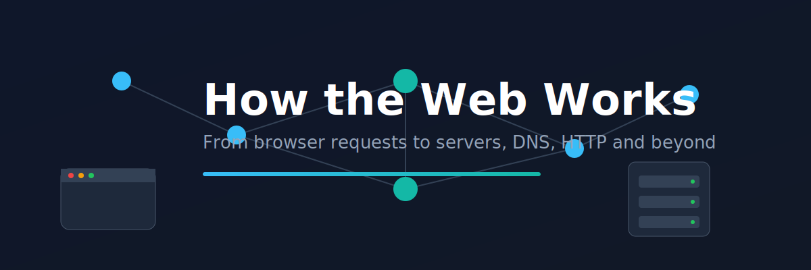

<p align="center">
  
</p>

# Lesson 01: How the Web Works

This lesson explains how the web works under the hood, from the moment a URL is entered in a browser to the response returned by a server.

It builds the mental model required to understand Django and backend development.

---

## What This Lesson Covers

- How the web works at a high level
- Clients and servers
- IP addresses and DNS
- HTTP fundamentals
- HTTP methods (GET, POST, etc.)
- HTTP request/response lifecycle
- How browsers process requests
- What happens on the server side
- Where Django fits into the system

---

## Lesson Structure

```text
Lesson01 - How the web works
│
├── 1.1 What happens when you type a URL.md
├── 1.2 Clients and Servers.md
├── 1.3 IP Addresses and DNS.md
├── 1.4 HTTP — The Language of the Web.md
├── 1.5 HTTP Methods.md
├── 1.6 HTTP Requests in Depth.md
├── 1.7 HTTP Responses in Depth.md
├── 1.8 How Browsers Work.md
├── 1.9 What Happens on the Server Side (1).md
├── 1.10 Where Django Lives in All of This.md
```

---

## Learning Outcome

After completing this lesson, you should be able to:

- Explain what happens when a URL is entered in a browser
- Understand how clients and servers communicate
- Describe DNS and IP resolution
- Understand HTTP requests and responses
- Explain how browsers and servers interact
- Understand where Django fits into web architecture

---

## Next Step

Continue to Lesson 02: Python Fundamentals for Django in the Django Get Set Go roadmap.