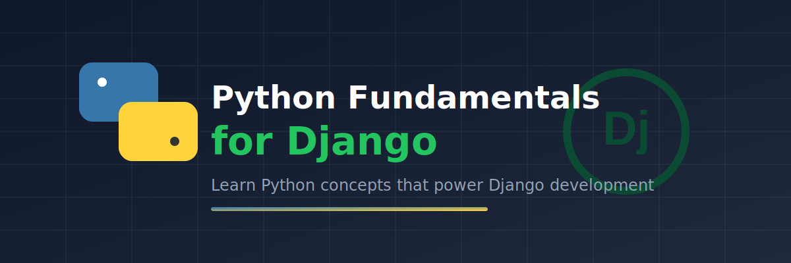

<p align="center">
  
</p>

# Lesson 02: Python Fundamentals for Django

Build the Python foundation required for effective Django development.

This lesson focuses on the Python concepts that appear throughout Django applications, helping you understand not just *how* Django works, but *why* it works the way it does.

---

## Learning Objectives

By the end of this lesson, you should be able to:

- Write clean and readable Python code
- Use functions effectively
- Understand object-oriented programming concepts
- Work with modules and packages
- Handle exceptions properly
- Understand generators and decorators
- Read and understand Django code with confidence

---

## Lesson Structure

```text
Lesson02 - Python Fundamentals for Django
│
├── 01_python_refresher.md
├── 02_control_flow.md
├── 03_functions.md
├── 04_oop_basics.md
├── 05_oop_advanced.md
├── 06_modules_and_packages.md
├── 07_file_handling.md
├── 08_error_handling.md
├── 09_iterators_and_generators.md
├── 10_decorators.md
├── 11_type_hints.md
└── 12_python_for_django_checklist.md
```

---

## Topics Covered

| Module | Topics |
|----------|----------|
| 01. Python Refresher | Variables, data types, operators, input/output |
| 02. Control Flow | if/elif/else, loops, comprehensions |
| 03. Functions | Functions, arguments, `*args`, `**kwargs`, lambdas, scope |
| 04. OOP Basics | Classes, objects, methods, `self`, `__init__` |
| 05. OOP Advanced | Inheritance, `super()`, dunder methods |
| 06. Modules & Packages | Imports, packages, `__init__.py`, pip, virtual environments |
| 07. File Handling | Reading, writing, context managers |
| 08. Error Handling | Exceptions, try/except/finally, custom exceptions |
| 09. Iterators & Generators | Iterables, iterators, generators, `yield` |
| 10. Decorators | Function decorators and practical usage |
| 11. Type Hints | Modern Python typing and annotations |
| 12. Django Readiness Checklist | Self-assessment before moving to Django |

---

## Why These Topics Matter for Django

Many Django features are built on core Python concepts:

- Models and views are Python classes.
- Django applications are Python packages.
- QuerySets make heavy use of iterators.
- Django relies extensively on decorators.
- Class-Based Views require a solid understanding of inheritance.
- Management commands, middleware, forms, and signals all depend on Python fundamentals.

A strong understanding of Python makes learning Django significantly easier.

---

## Next Step

After completing this lesson, continue to the next lesson in the **Django Get Set Go** roadmap and begin working with Django-specific concepts and applications.

---

## Repository

Part of the **Django Get Set Go** learning series.

GitHub: https://github.com/me-anurag/django-get-set-go