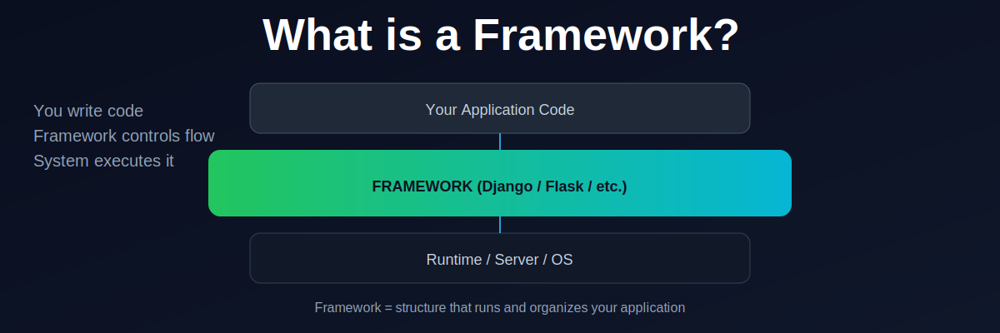

  

# What is a Framework?

A framework provides structure, tools, and conventions that help developers build applications faster and in a more organized way.

This lesson explains what frameworks are and why they are used in modern web development, especially in Django.

---

## Key Ideas

- What a framework is
- Why frameworks exist
- Framework vs library
- How frameworks provide structure
- Why Django is considered a framework

---

## Outcome

By the end of this lesson, you should be able to:

- Explain what a framework is in simple terms
- Understand the difference between frameworks and libraries
- Understand why Django is structured the way it is

---

## Next Step

Continue to the next lesson in the Django Get Set Go learning path.