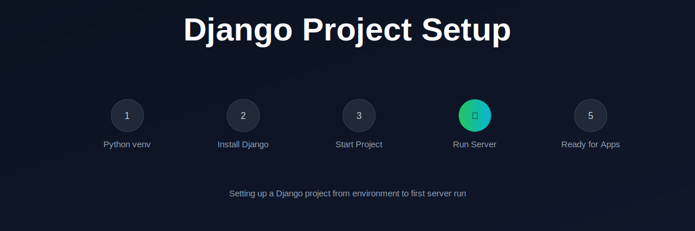

<p align="center">
  
</p>

# Django Project Setup

This repository explains how to set up a Django project from scratch.

It covers the basic steps required to go from a clean system to a running Django development server.

---

## What You Will Learn

- Creating a virtual environment
- Installing Django
- Starting a Django project
- Running the development server
- Basic project structure

---

## Setup Steps

```bash
# Create virtual environment
python -m venv env

# Activate environment
# Windows:
env\Scripts\activate

# Mac/Linux:
source env/bin/activate

# Install Django
pip install django

# Create project
django-admin startproject project_name

# Run server
python manage.py runserver
```

---

## Outcome

After completing this setup, you will have a running Django project ready for development.

---

## Next Step

Start building apps inside your Django project.