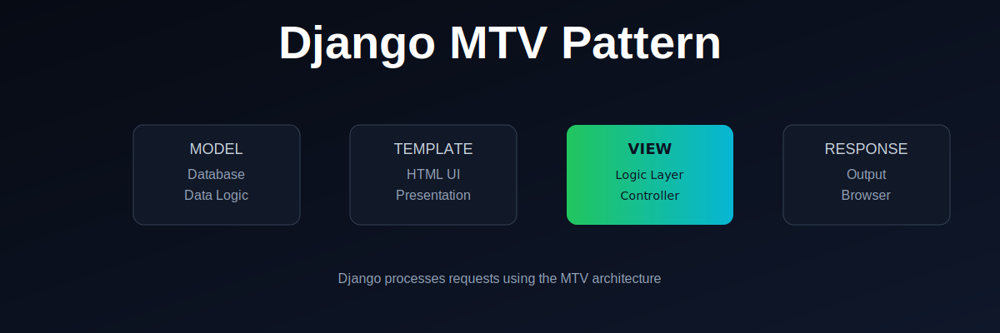

  

# Django MTV Pattern

This repository explains the **MTV (Model–Template–View)** architecture used in Django.

---

## What is MTV?

Django follows the MTV pattern:

- **Model** → Handles data and database logic
- **Template** → Handles presentation (HTML)
- **View** → Handles logic and connects Model + Template

---

## Flow

1. Request comes from the browser  
2. View processes the request  
3. Model fetches or updates data  
4. Template renders the UI  
5. Response is returned to the browser  

---

## Why it matters

Understanding MTV is essential because:

- It defines Django’s structure
- It separates logic, data, and UI
- It makes applications scalable and maintainable

---

## Outcome

After this lesson, you should be able to:

- Explain the MTV architecture clearly
- Identify what each component does
- Understand request flow in Django

---

## Next Step

Move on to building actual Django apps using MTV.