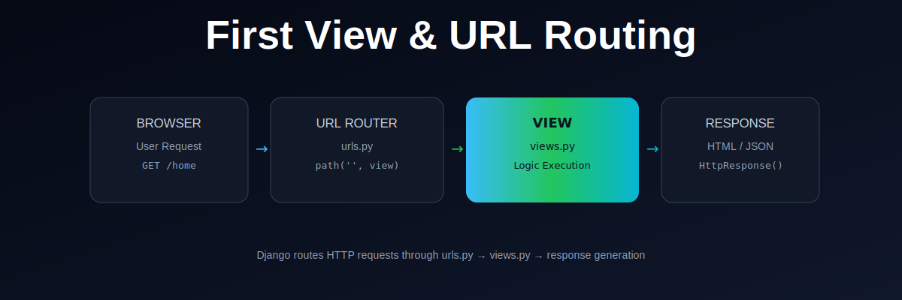

  

# First View & URL Routing in Django

This repository explains how Django handles **URLs and views** to process a request and return a response.

---

## What You Will Learn

- What URL routing is in Django
- How `urls.py` works
- How views are created in `views.py`
- How Django maps URLs to functions
- How a request flows through the system

---

## Request Flow

1. User enters a URL in the browser  
2. Django checks `urls.py`  
3. Matching route is found  
4. Corresponding view is executed  
5. Response is returned to the browser  

---

## Key Concepts

- URL Dispatcher
- View Functions
- Request/Response Cycle
- Django routing system

---

## Outcome

After completing this lesson, you should be able to:

- Create a basic view in Django
- Map URLs to views
- Understand how Django processes a request

---

## Next Step

Move forward to building more complex views and templates in Django.