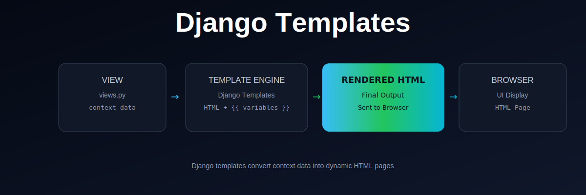

  

# Django Templates

This repository explains how Django uses **templates** to generate dynamic HTML pages.

---

## What You Will Learn

- What Django templates are
- How views pass data to templates
- How template rendering works
- How HTML becomes dynamic using variables
- How final output is sent to the browser

---

## Flow

1. View prepares data (context)
2. Data is sent to template
3. Template engine processes HTML + variables
4. Final HTML is generated
5. Browser displays the page

---

## Key Concepts

- Template Engine
- Context Data
- Variable Rendering
- Dynamic HTML
- Separation of logic and UI

---

## Outcome

After this lesson, you should be able to:

- Create and use Django templates
- Pass data from views to templates
- Render dynamic HTML pages

---

## Next Step

Move on to understanding Django models and database integration.