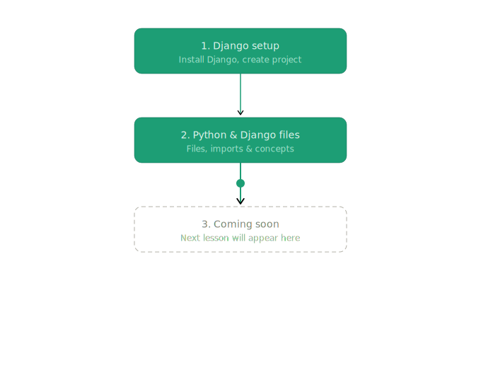

# Django Learning Path

My step-by-step journey learning Django — updated as I go.



## Lessons

| # | Topic | Status |
|---|-------|--------|
| 1 | Django setup | ✅ Done |
| 2 | Python & Django files | 🔜 Next |

---

## Notes

### 1. Django setup
```bash
pip install django
django-admin startproject myproject
cd myproject
python manage.py runserver
```

### 2. Python & Django files
- `manage.py` — CLI tool to run commands
- `settings.py` — all project config lives here
- `urls.py` — URL routing
- `views.py` — logic that handles requests

---

> next lesson will come here
